# Protein Data Bank (PDB) Viewer
Visualization of proteins directly from the PDB database or from a .pdb file.

Visualization example with protein 13PK:

| |Ball and Stick | Backbone | Space-Filling | Ribbon | Cartoon
:---|:---:|:---:|:---:|:---:|:---:
CPK | 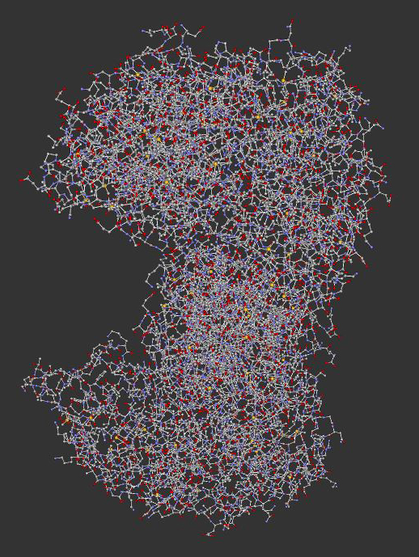  |  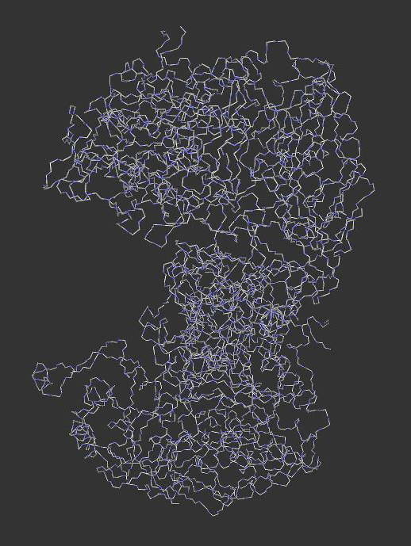 |  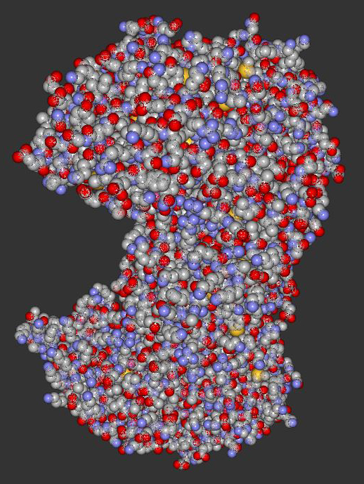 | 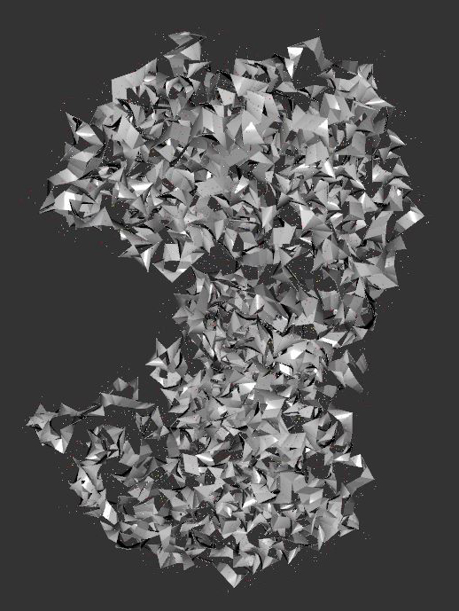 | 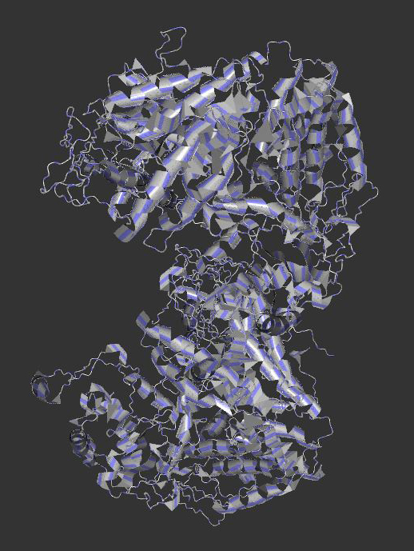
Structure | 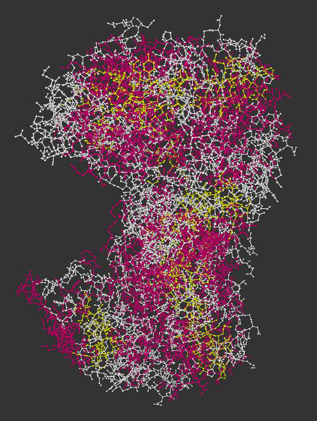  |  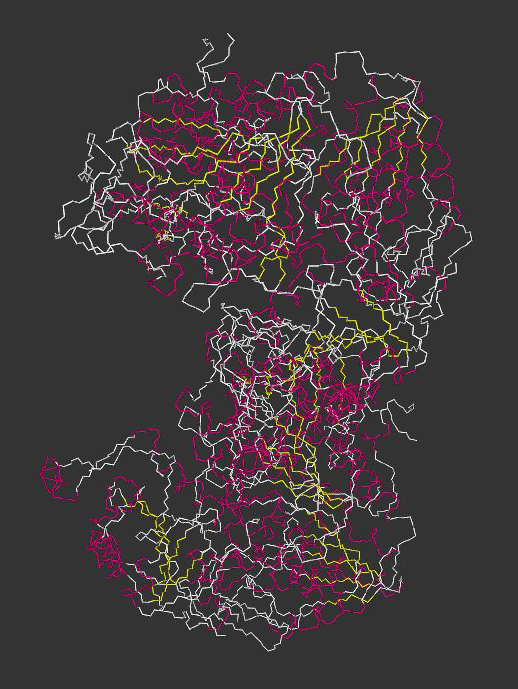 |  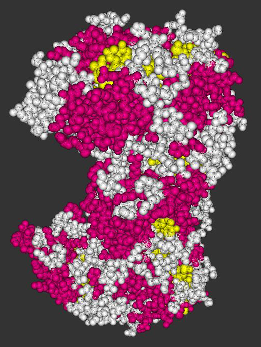 | 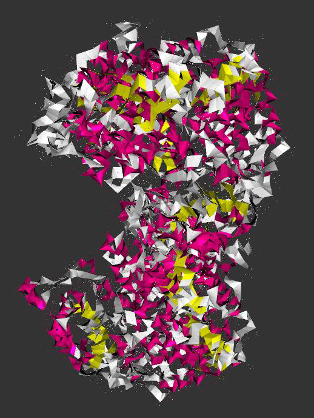 | 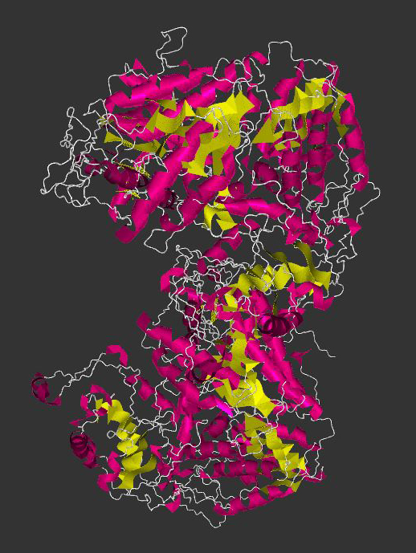
Shapely | 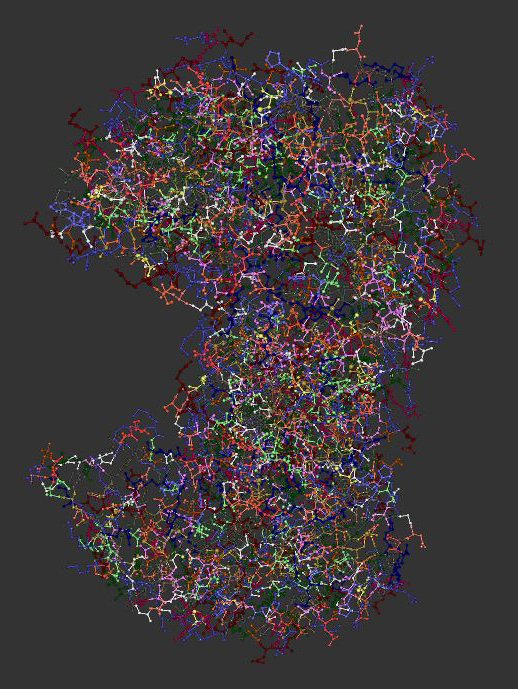  |  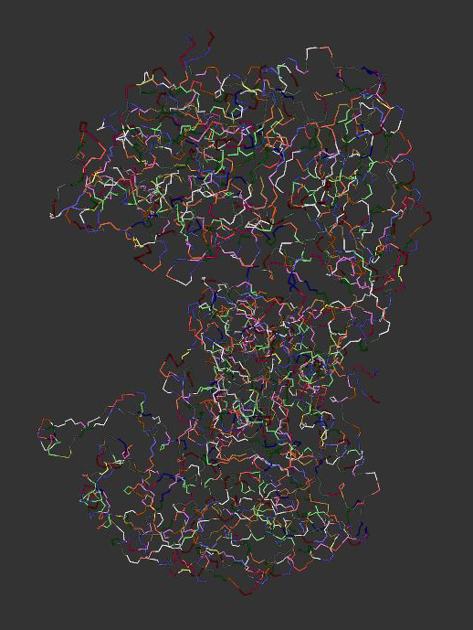 |  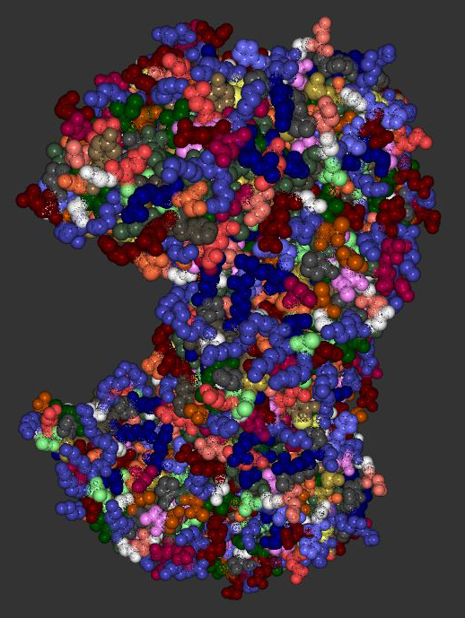 | 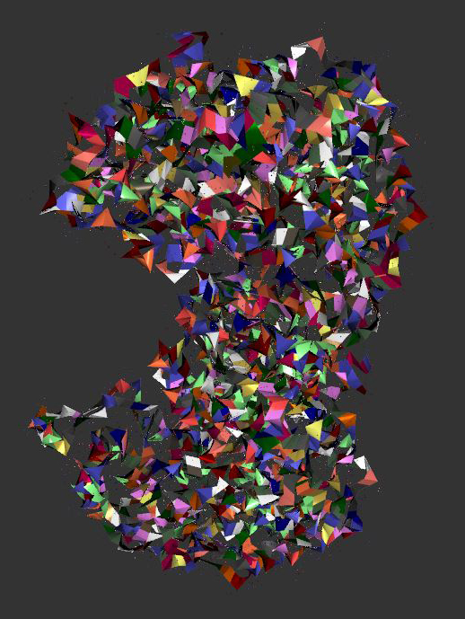 | 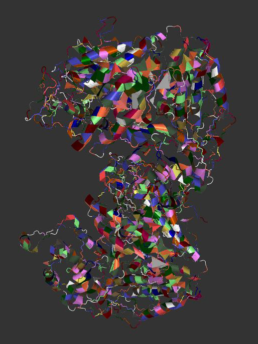
Sequence | 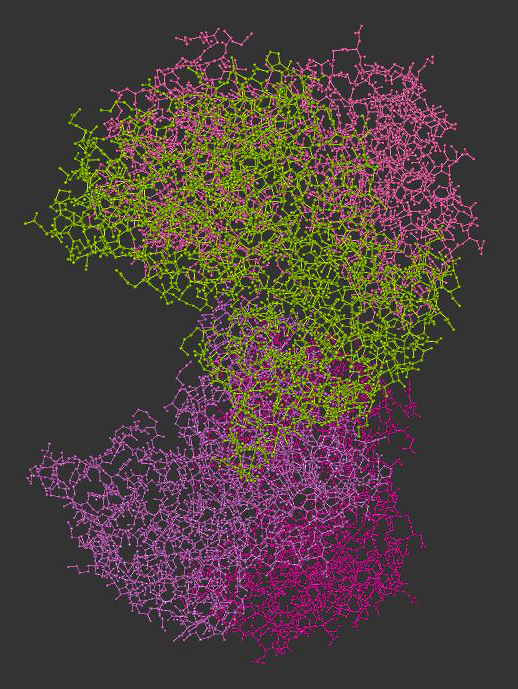  |  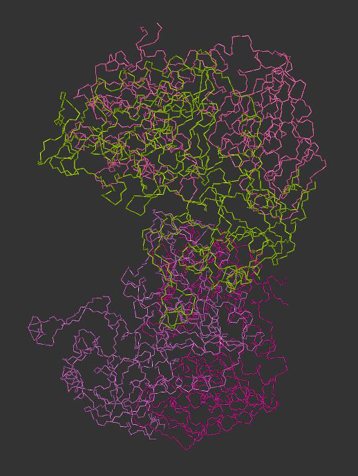 |  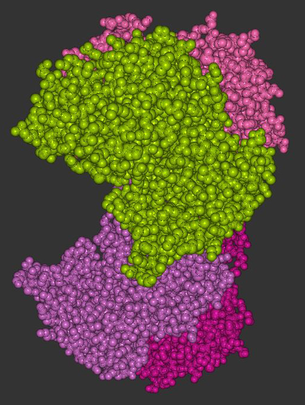 | 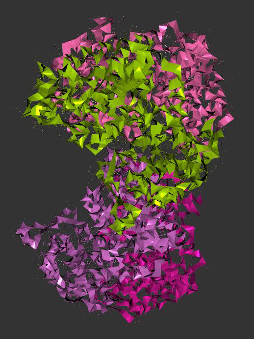 | 
Temperature | 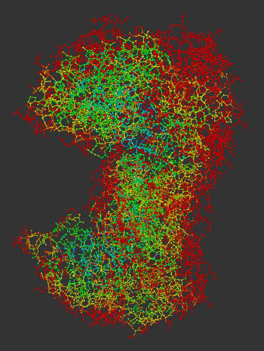  |   |  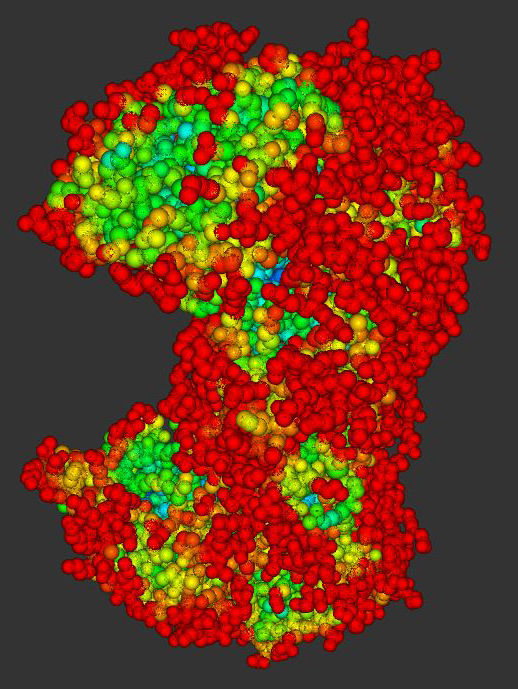 | 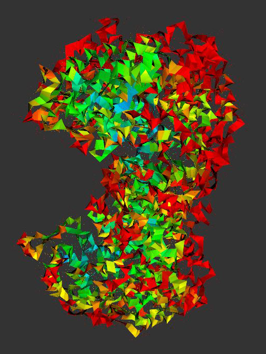 | 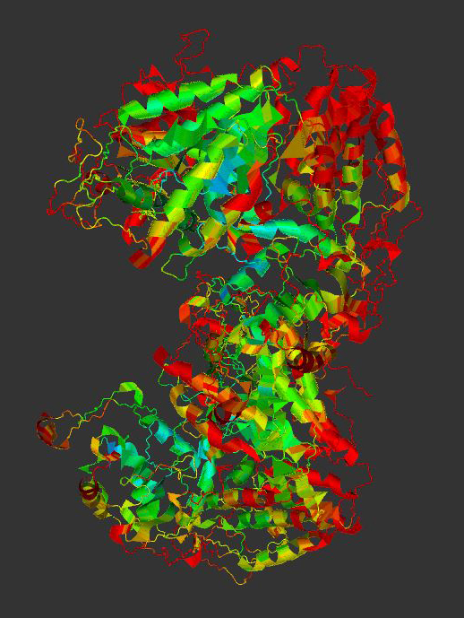

Overview over the whole PDB viewer:

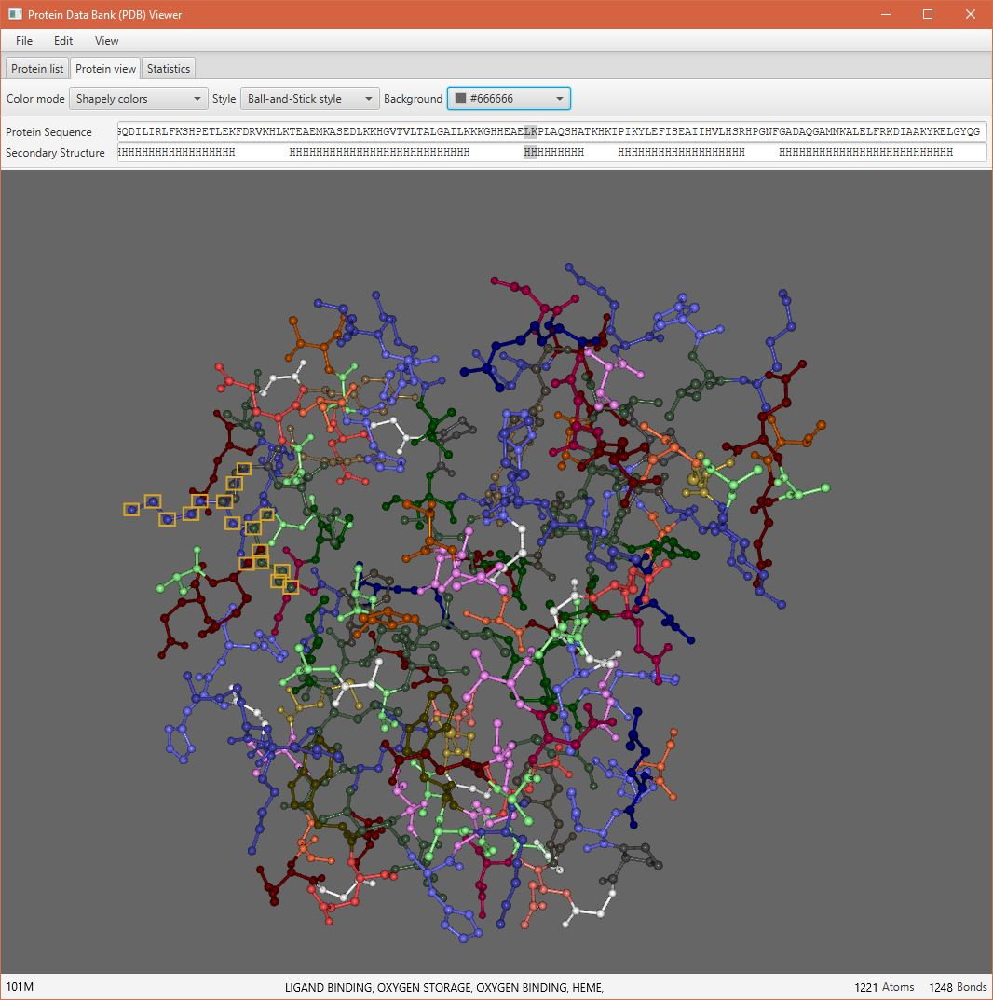

## Features

- Load list of proteins from the [RCSB PDB RESTful Web Service interface](http://www.rcsb.org/pdb/software/rest.do)
- Load protein data in the Protein Data Bank (PDB) format from [RCSB](https://www.rcsb.org/)
- Save protein data as `.pdb` file
- Load protein data from a `.pdb` file
- Color modes: 
    - [CPK](http://acces.ens-lyon.fr/biotic/rastop/help/elementtable.htm)
    - [Structure](http://acces.ens-lyon.fr/biotic/rastop/help/colour.htm#structurecolours)
    - [Shapely](http://acces.ens-lyon.fr/biotic/rastop/help/colour.htm#shapelycolours)
    - Sequence
    - [Temperature](https://pdb101.rcsb.org/learn/guide-to-understanding-pdb-data/dealing-with-coordinates)
- Styles 
    - Ball and Stick
    - Backbone
    - Space-Filling
    - Ribbon
    - Cartoon
- Change background color
- Proportional [atom radius](https://en.wikipedia.org/wiki/Atomic_radius) (only for *Ball and Stick*, *Backbone* and *Ribbon style*)
- Side chain connections in *Ball and Stick* style
- Protein sequence and secondary structure in text fields
- Mark / highlight atoms of amino acids in the protein graph and the sequence fields (except in the Cartoon style)
- Rotate 3D protein graph around its center
- Zoom in and out
- Show simple statistics about the protein
- Filter list of proteins by PDB id, classification and title

[//]: # (Add sources for styles)

## Requirements

- Internet connection to initially load and to update the protein list
- Internet connection to load protein data from [RCSB](https://www.rcsb.org/)
- Java 1.8+

## Contribution

Feel free to submitting issues and pull requests.

## Authors

* **Sebastian Penhouët** - *Initial work* - [Spenhouet](https://github.com/Spenhouet)

## License

This project is licensed under the MIT License - see the [LICENSE](LICENSE) file for details

## Acknowledgments

* Spline implementation from: [Java-Gaming.org - tusaki - 2D & 3D Spline](http://www.java-gaming.org/index.php?topic=9830.0)